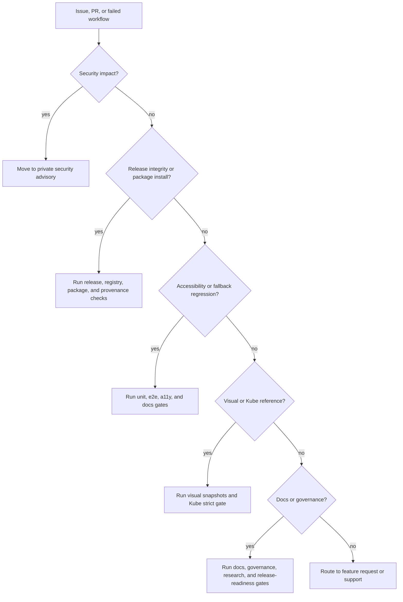
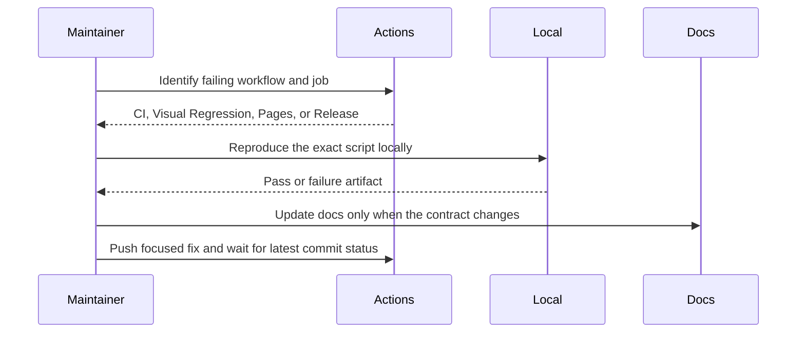

# Maintainer Runbook

This runbook turns the open-source governance docs into repeatable maintainer
actions. It is intentionally operational: what to check, what to run, and what
not to claim.

The benchmark remains structural. It follows the public maintenance shape used
by shadcn/ui, Radix UI, Chakra UI, and HeroUI: clear first screen, contribution
path, docs site, security policy, release gates, visual evidence, and explicit
package distribution status. It does not copy source code or project prose from
those repositories.

## Current Status

The package is not published to npm yet. Keep this sentence true until the first
successful npm release workflow proves otherwise.

| Surface         | Current state                                                         | Maintainer action                                                             |
| --------------- | --------------------------------------------------------------------- | ----------------------------------------------------------------------------- |
| npm package     | Not published to npm yet.                                             | Keep install and registry docs in prepared-but-not-live language.             |
| Storybook Pages | Workflow succeeds; deploy waits for GitHub Pages source settings.     | Enable Pages with GitHub Actions, then update homepage after deploy succeeds. |
| Kube parity     | Strict gate is release-candidate evidence; exact parity remains open. | Keep `pnpm test:kube-reference:exact` out of release claims until it passes.  |
| Main branch     | CI and Visual Regression are green on recent pushes.                  | Protect `main` and require `ci` plus `visual` before external contributions.  |
| Registry        | Files are generated and tested.                                       | Validate consumer commands only after npm publish.                            |

## Triage Flow

## Required Commands By Change Type

| Change type                       | Minimum local proof                                                                                             | Extra proof before merge                                                                  |
| --------------------------------- | --------------------------------------------------------------------------------------------------------------- | ----------------------------------------------------------------------------------------- |
| Docs, governance, templates       | `pnpm format`, `pnpm lint`, `pnpm typecheck`, `pnpm test:docs`, `pnpm test:release-readiness`, `pnpm test:unit` | `pnpm test:governance`, `pnpm test:research`                                              |
| Component API or behavior         | Standard local proof plus `pnpm test:inventory`, `pnpm test:component-coverage`                                 | `pnpm test:e2e`, `pnpm test:a11y`, `pnpm test:storybook`                                  |
| Visual, optical, or Kube behavior | Standard local proof plus `pnpm test:physics`, `pnpm test:visual`, `pnpm test:kube-reference:strict`            | Attach or inspect generated visual artifacts before merge.                                |
| Registry or package files         | Standard local proof plus `pnpm test:registry`, `pnpm test:shadcn-parity`, `pnpm test:package`                  | Consumer install validation after npm publish only.                                       |
| Release candidate                 | `pnpm verify`                                                                                                   | Confirm CI, Visual Regression, release workflow permissions, `NPM_TOKEN`, and provenance. |

## CI Failure Handling

- Do not rerun blindly if the failure points to a deterministic contract break.
- Do not relax Kube, visual, accessibility, or release gates without documenting
  why the previous threshold was wrong.
- If public Kube reference sampling is polluted, recover the target page and
  keep candidate Storybook failures hard-failing.
- If `gh` is unavailable, use the public GitHub Actions page and local scripts
  as the source of truth.

## Release Procedure

1. Confirm `main` is clean and synchronized with `origin/main`.
2. Run `pnpm verify`.
3. Confirm `pnpm test:kube-reference:exact` status separately. Passing strict
   Kube is not exact parity.
4. Confirm repository settings:
   - Pages source is GitHub Actions.
   - Wiki is disabled while repository docs are canonical.
   - Required checks include `ci` and `visual`.
5. Confirm `NPM_TOKEN` exists only for the release environment.
6. Confirm `NPM_CONFIG_PROVENANCE=true` and `id-token: write` remain in the
   release workflow.
7. Use Changesets for versioning and publishing.
8. After npm publish succeeds, validate:
   - clean package install;
   - package exports;
   - shadcn-style registry URL;
   - README install language.

## Pages Procedure

1. Enable Pages with GitHub Actions as the source.
2. Push a docs-only change or manually rerun Storybook Pages.
3. Confirm build and deploy jobs both succeed.
4. Set the repository homepage to the Pages URL.
5. Run `CHECK_REMOTE_GOVERNANCE=1 pnpm audit:governance`.

Until step 3 succeeds, do not claim a public Storybook docs site.

## Security Procedure

- Use private security advisories for vulnerabilities.
- Do not ask reporters to post exploit details in public issues.
- Keep `SECURITY.md` as the public policy.
- Patch privately when necessary, then publish a normal release note after the
  fix is available.

## Rollback Procedure

| Failure                      | Rollback action                                                                                         |
| ---------------------------- | ------------------------------------------------------------------------------------------------------- |
| Docs or Storybook content    | Revert the commit and let Pages redeploy after Pages is enabled.                                        |
| Package export regression    | Publish a patch release that restores the previous export behavior.                                     |
| Registry metadata regression | Regenerate registry files, run `pnpm test:registry`, and publish a patch if npm consumers are affected. |
| Accessibility regression     | Revert or patch immediately; do not ship visual polish over broken semantics.                           |
| Kube exact parity regression | Keep exact parity unclaimed; strict gate remains the release-candidate baseline.                        |

## Completion Checks

Before describing the project as ready for public launch, all of these must be
true:

- remote-aware governance score has no Pages, homepage, or wiki failures;
- `pnpm verify` passes on the release commit;
- Visual Regression and CI are green on `main`;
- first npm publish with provenance has succeeded;
- registry consumer path has been validated after npm publish;
- README, `docs/installation.md`, and `docs/shadcn-registry.md` no longer carry
  pre-publish language that contradicts reality.
