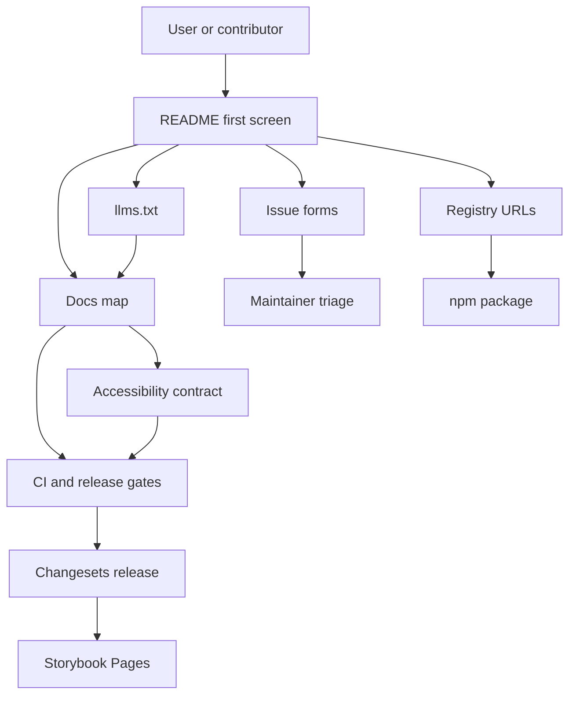
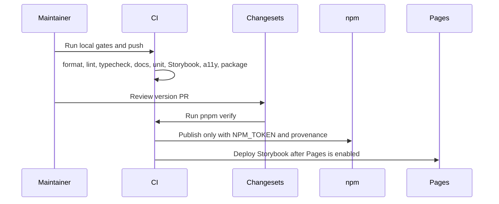

# Open Source Governance

This project follows the useful parts of larger React UI libraries without
copying their monorepo complexity or source code.

## Reference Projects

| Project             | Useful pattern                                                                                                           | Local decision                                                                                                                |
| ------------------- | ------------------------------------------------------------------------------------------------------------------------ | ----------------------------------------------------------------------------------------------------------------------------- |
| shadcn/ui           | README routes users to docs, contributing, security, registry distribution, and assistant-facing docs.                   | Keep registry shims package-backed, add `llms.txt`, and document that registry install requires npm publication.              |
| Radix UI Primitives | Accessibility-first component positioning and clear primitive boundaries.                                                | Keep `LiquidSurface` as the engine boundary and test semantics separately from optical styling in `docs/accessibility.md`.    |
| Chakra UI           | Contributor guidance separates user questions, styling issues, accessibility, and release work.                          | Use issue forms and contributor docs to route bug, feature, registry, accessibility, and release concerns.                    |
| HeroUI              | Full component library governance with templates, CODEOWNERS, docs, release automation, and AI-oriented discoverability. | Keep a small single-package governance layer: templates, CODEOWNERS, Changesets, CI gates, Pages, Dependabot, and `llms.txt`. |

Component pages follow `docs/component-documentation.md`: status, install
honesty, usage, anatomy, API, visual states, accessibility behavior, registry
distribution, and verification evidence must be reviewable before a component is
described as public-ready. The first package-backed pages live in
`docs/components/index.md`.

Tracked repository identifiers: `shadcn-ui/ui`, `radix-ui/primitives`,
`chakra-ui/chakra-ui`, and `heroui-inc/heroui`.

## Governance Surface

## Required Local Gates

| Gate                           | Purpose                                                                              |
| ------------------------------ | ------------------------------------------------------------------------------------ |
| `pnpm format`                  | Formatting stays deterministic.                                                      |
| `pnpm lint`                    | Source and docs-adjacent scripts stay clean.                                         |
| `pnpm typecheck`               | Public TypeScript contracts still compile.                                           |
| `pnpm test:docs`               | Required open-source docs, templates, references, and registry claims exist.         |
| `pnpm test:governance`         | Governance scorecard stays above the local readiness threshold.                      |
| `pnpm test:research`           | Reference provenance stays explicit and third-party source is not copied.            |
| `pnpm test:inventory`          | Component inventory stays synchronized with the public component surface.            |
| `pnpm test:component-coverage` | Component-facing tests stay mapped to the documented inventory.                      |
| `pnpm test:visual-docs`        | Visual state coverage stays mapped to Storybook, snapshots, a11y, and Pages.         |
| `pnpm test:registry`           | Generated registry files match component inventory.                                  |
| `pnpm test:release-readiness`  | Package metadata, workflows, docs, and release scripts stay aligned.                 |
| `pnpm test:unit`               | Pure logic and component behavior stay covered.                                      |
| `pnpm test:e2e`                | Browser behavior stays verified through Playwright.                                  |
| `pnpm test:a11y`               | Storybook examples stay free of critical and serious axe violations.                 |
| `pnpm verify`                  | Release-candidate gate including visual, strict Kube reference, and package dry run. |

Visual Regression runs on pull requests and every main push so the default
branch has a public visual gate signal, not only local evidence.

## Visual Documentation

The visual documentation contract lives in `docs/visual-documentation.md`. It
keeps Storybook examples, visual snapshots, a11y checks, Pages deployment, and
Kube reference claims tied to one standard instead of scattered prose.

## Accessibility Contract

The accessibility contract lives in `docs/accessibility.md`. It separates what
is actually gate-backed from what is not yet claimed: native-first semantics,
ARIA/APG behavior for composite widgets, keyboard and focus behavior, reduced
motion, reduced transparency, high contrast, mobile fallback, and the limits of
axe and Storybook evidence.

## Current Gaps

| Gap                              | Risk                                                                   | Next action                                                                 |
| -------------------------------- | ---------------------------------------------------------------------- | --------------------------------------------------------------------------- |
| npm package is not published     | Consumers cannot install package or package-backed registry items yet. | Keep docs explicit until the first successful release.                      |
| GitHub Pages is not enabled      | Storybook deploy is skipped while the public docs URL is unavailable.  | Set Pages source to GitHub Actions in repository settings.                  |
| `main` is not protected yet      | Broken commits can land after the first green run.                     | Require `ci` and `visual` once both are stable.                             |
| Dependabot can open too many PRs | Dependency noise hides real release work.                              | Group actions, Storybook, test tooling, runtime engines, and React updates. |
| Exact Kube parity is incomplete  | Overclaiming 1:1 parity would mislead users.                           | Keep exact parity separate from release readiness until it passes.          |

## Release Flow

## Non-Goals

- Do not copy source from shadcn/ui, Radix UI, Chakra UI, HeroUI, Kube, rdev, or shuding.
- Do not claim npm availability before the package is published.
- Do not add enterprise-scale process that a single-package library cannot maintain.
