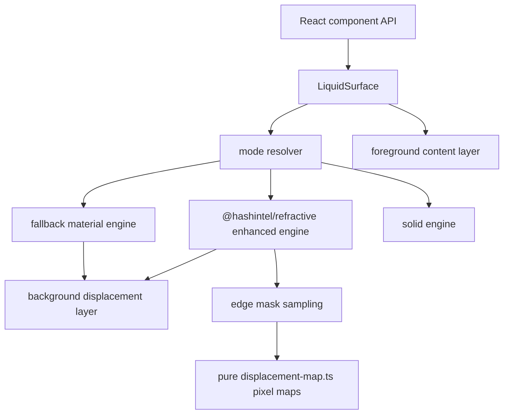

# Optics Architecture

This package treats Liquid Glass as an optical system, not as a decorative blur.
The implementation is split into small layers so the component API can stay
stable while the refraction engine improves.

## Layers

`LiquidSurface` is the only high-level boundary that selects an engine. Buttons,
tabs, search inputs, switches, and nav components compose `LiquidSurface`; they do
not import `@hashintel/refractive` directly.

## Physical Invariants

- Foreground content is sharp and sits outside the displacement filter layer.
- Enhanced refraction bends the background, not the readable product text.
- Intensity is monotonic: strong mode cannot produce less displacement than
  subtle mode for the same geometry.
- Filter radius is capped by physical geometry unless a lens explicitly opts into
  overscan.
- Filter slices must not overlap in a way that creates crossing seams.
- Invalid input must clamp to finite optical values instead of leaking `NaN`.
- Fake crosshatch or stripe textures are forbidden; visible lines must come from
  the background being refracted.
- Focus state changes material depth and scale. Hard white or black outline rings
  are treated as a regression.
- Edge masks are monotonic: edge refraction fades inward while clean-center
  opacity rises. The center is restored; it is not a second distorted layer.

These invariants are covered by `tests/refraction-physics.test.ts` and
`tests/edge-mask.test.ts`. `tests/displacement-map.test.ts` additionally samples
the actual generated RGBA maps so edge direction, neutral center behavior, and
specular alpha cannot regress silently.

## Engine Strategy

Chrome and Chromium are the only enhanced targets today because the underlying
SVG backdrop-filter behavior is still browser-specific. Safari, Firefox, iOS,
reduced transparency, high contrast, and low-power mobile paths are first-class
fallback targets.

The default enhanced path is `@hashintel/refractive`. The experimental reference
lens path exists for comparison and fixture work only. It helps us reason about
rounded lens geometry, two-pass displacement, and pointer-driven interaction
without leaking article-specific code into the component API.

`src/utils/displacement-map.ts` owns generated RGBA pixel maps for the reference
lens. It is deliberately pure: it samples the capsule field, converts optical
magnitudes into red/green SVG displacement channels, and generates specular alpha
without touching React state or the DOM. `LensReferenceEngine` only converts
those maps into browser data URLs and wires them into the two-pass SVG filter.

The reference lens can vary the two pass strengths through refraction options.
The idle Kube-like magnifier uses `glassThickness: 88` and
`magnificationGlassThickness: 21.5`; the active pointer state uses
`glassThickness: 110` and `magnificationGlassThickness: 43`. Keeping those
numbers in the pipeline makes pressed/dragged tests validate real SVG
displacement changes instead of only checking a CSS transform.

## Edge Mask Model

`sampleLiquidEdgeMask()` is the package-level contract for edge-only refraction.
It models the material as two blended zones:

- the bevel owns refraction and optional chromatic aberration,
- the center returns to clean material so icons and labels stay readable.

This model was added after inspecting `rdev/liquid-glass-react`, which uses a
filter composition with edge aberration and a clean center. We keep the physical
idea, but not its baked map assets or single-component architecture.

## Why The Center Must Stay Calm

The Kube reference components show edge bending and frosted center material. If
the whole pill is displaced with equal force, the result looks like plastic and
creates impossible crossing lines. A better model concentrates displacement near
the bevel, keeps the center readable, and adds restrained specular highlights.

## Test Gates

- `pnpm test:physics` checks pure optical math and DOM layering contracts.
- `pnpm test:storybook` runs real pointer, focus, hover, press, and drag behavior
  against built Storybook stories.
- `pnpm test:kube-reference` captures the public Kube reference and compares
  selected local stories with screenshot diff thresholds.
- `pnpm test:visual` tracks deterministic component screenshots.
