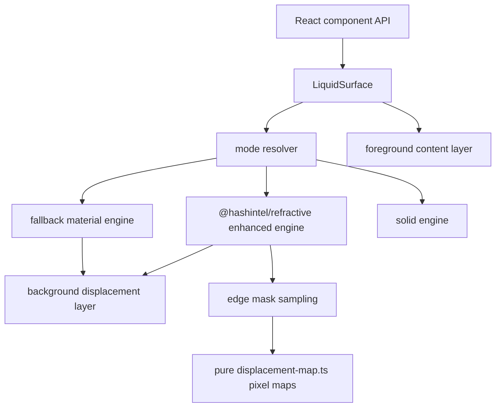

# Optics Architecture

This package treats Liquid Glass as an optical system, not as a decorative blur.
The implementation is split into small layers so the component API can stay
stable while the refraction engine improves.

## Layers

`LiquidSurface` is the only high-level boundary that selects an engine. Buttons,
tabs, search inputs, switches, and nav components compose `LiquidSurface`; they do
not import `@hashintel/refractive` directly.

## Physical Invariants

- Foreground content is sharp and sits outside the displacement filter layer.
- Enhanced refraction bends the background, not the readable product text.
- Intensity is monotonic: strong mode cannot produce less displacement than
  subtle mode for the same geometry.
- Filter radius is capped by physical geometry unless a lens explicitly opts into
  overscan.
- Filter slices must not overlap in a way that creates crossing seams.
- Invalid input must clamp to finite optical values instead of leaking `NaN`.
- Fake crosshatch or stripe textures are forbidden; visible lines must come from
  the background being refracted.
- Focus state changes material depth, material alpha, foreground contrast, and
  scale. Hard white or black outline rings and dark focus slabs are treated as a
  regression.
- Edge masks are monotonic: edge refraction fades inward while clean-center
  opacity rises. The center is restored; it is not a second distorted layer.
- Chromatic aberration is edge-only and normal-aligned. Red and blue may split
  around the green channel at the bevel, but tangent smear and center color
  splitting are regressions.

These invariants are covered by `tests/refraction-physics.test.ts` and
`tests/edge-mask.test.ts`. `tests/displacement-map.test.ts` additionally samples
the actual generated RGBA maps so edge direction, neutral center behavior, and
specular alpha cannot regress silently.
`src/utils/chromatic-aberration.ts` owns the optional RGB split model, and
`tests/chromatic-aberration.test.ts` covers it before it is allowed into any
browser engine.

## Engine Strategy

Chrome and Chromium are the only enhanced targets today because the underlying
SVG backdrop-filter behavior is still browser-specific. Safari, Firefox, iOS,
reduced transparency, high contrast, and low-power mobile paths are first-class
fallback targets.

The default enhanced path is `@hashintel/refractive`. The experimental reference
lens path exists for comparison and fixture work only. It helps us reason about
rounded lens geometry, two-pass displacement, and pointer-driven interaction
without leaking article-specific code into the component API.

`src/utils/displacement-map.ts` owns generated RGBA pixel maps for the reference
lens. It is deliberately pure: it samples the Kube-style rectangular
magnification field, samples the capsule bevel field, converts optical
magnitudes into red/green SVG displacement channels, and generates specular
alpha without touching React state or the DOM. `LensReferenceEngine` only
converts those maps into browser data URLs and wires them into the two-pass SVG
filter.

The two pixel maps are intentionally different. `createLensMagnificationPixelMap`
models source zoom as a full rectangular center-pull field. The capsule field is
used by `createLensDisplacementPixelMap` for the bevel pass, but its effective
falloff is narrower than the capsule radius. The `75px` radius defines shape;
the `25px` displacement falloff defines where the edge bends back to neutral.
Collapsing those two maps into one edge-only function, or using the full radius
as displacement falloff, is a regression because it produces non-physical
crossing lines instead of a coherent optical pull followed by edge bending.

`createLensSpecularPixelMap` is a separate thin-rim model. It keeps the center
transparent, fades out again a few pixels inside the edge, and uses gray
directional intensity instead of opaque white. Wide white highlights are treated
as plastic, not glass, and are covered by pixel-map tests.

The reference lens can vary the two pass strengths through refraction options,
but the Kube parity stories intentionally keep the live target values:
`glassThickness: 88` and
`magnificationGlassThickness: 21.496810403025258`. Browser contract artifacts now
verify that idle, pressed, and dragged captures all expose the same two-pass
filter scales as the public Kube page. Pointer parity therefore belongs to
geometry, background phase, and material response; increasing SVG displacement
for active state would be a fake pass.

## Edge Mask Model

`sampleLiquidEdgeMask()` is the package-level contract for edge-only refraction.
It models the material as two blended zones:

- the bevel owns refraction and optional chromatic aberration,
- the center returns to clean material so icons and labels stay readable.

This model was added after inspecting `rdev/liquid-glass-react`, which uses a
filter composition with edge aberration and a clean center. We keep the physical
idea, but not its baked map assets or single-component architecture.

`resolveLiquidChromaticAberration()` is the matching channel-split contract. It
returns a pure sample with red, green, and blue offsets so engines can apply
color separation without distorting foreground content or inventing diagonal
texture. The reference lens engine wires it into an opt-in SVG channel split;
the default Kube parity stories keep `chromaticAberration` unset so the live
two-pass filter contract remains unchanged.

## Why The Center Must Stay Calm

The Kube reference components show edge bending and frosted center material. If
the whole pill is displaced with equal force, the result looks like plastic and
creates impossible crossing lines. A better model concentrates displacement near
the bevel, keeps the center readable, and adds restrained specular highlights.

## Test Gates

- `pnpm test:physics` checks pure optical math and DOM layering contracts.
- `pnpm test:storybook` checks enhanced rendering contracts against built
  Storybook stories.
- `pnpm test:e2e` runs real pointer, focus, hover, press, and drag behavior
  against built Storybook stories.
- `pnpm test:kube-reference` captures the public Kube reference and compares
  selected local stories with screenshot diff thresholds.
- `pnpm test:kube-reference:strict` promotes interactive pressed and dragged
  lens screenshots into hard Kube parity gates.
- `pnpm test:visual` tracks deterministic component screenshots.
