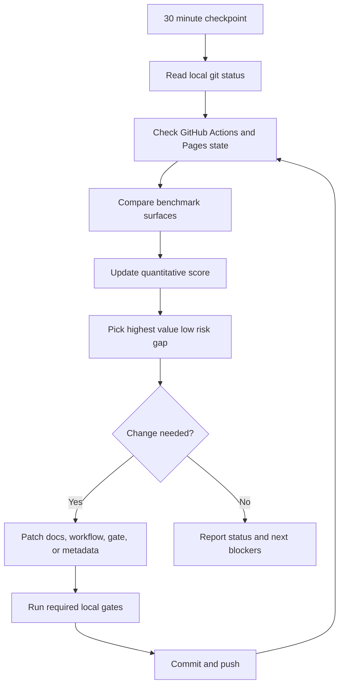
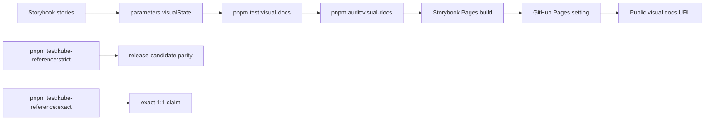

# Progress Checkpoints

This file is the repeatable progress rubric for the open-source UI library
governance goal. It is intentionally stricter than `pnpm audit:governance`:
the local governance gate proves repository structure, while this checkpoint
also scores public launch evidence, component documentation depth, remote
settings, and visible documentation gaps.

Use it for the recurring 30 minute review loop and for manual maintainer
handoffs. Scores should move only when there is file, command, workflow,
repository setting, or public URL evidence.

The machine-readable source for the launch-progress score is:

```sh
pnpm audit:launch
pnpm --silent audit:launch:json
CHECK_REMOTE_LAUNCH=1 pnpm --silent audit:launch:json
pnpm audit:visual-docs
```

## Checkpoint Loop



## Benchmark References

The checkpoint compares project governance against the public surfaces of:

- `shadcn-ui/ui`: first screen clarity, registry distribution, public docs,
  and install path honesty.
- `radix-ui/primitives`: accessibility posture, primitive boundaries, and
  documentation depth.
- `chakra-ui/chakra-ui`: contributor routing, security policy, release
  discipline, and broad component documentation.
- `heroui-inc/heroui`: visual change evidence, docs synchronization, and
  package-level release operations.

Do not copy their code, screenshots, README prose, or issue wording. The
comparison is structural. Reference provenance belongs in `ATTRIBUTIONS.md` or
`docs/reference-provenance.json`.

## Quantitative Scorecard

This score is a launch-progress score, not the local governance script score.
It should stay conservative until npm, Pages, and exact Kube parity are proven.

| Area                       | Score | Current evidence                                                              | Remaining blocker                                     |
| -------------------------- | ----- | ----------------------------------------------------------------------------- | ----------------------------------------------------- |
| Repository first screen    | 9/10  | README, project status, docs map, topics, package metadata.                   | Public homepage should point to live Storybook Pages. |
| Documentation structure    | 9/10  | Docs index, adoption, accessibility, testing, governance, release evidence.   | Keep new checkpoint docs linked from entry points.    |
| Component documentation    | 10/10 | 60 package-backed component pages plus Provider and Surface foundation pages. | Keep future inventory additions page-backed.          |
| Contribution workflow      | 9/10  | Issue forms, PR template, CODEOWNERS, CONTRIBUTING, support, security.        | Apply branch protection remotely.                     |
| Release and CI gates       | 8/10  | CI, visual, release, Pages workflows, Node 24, local verification scripts.    | Latest main workflow must stay green before release.  |
| Registry distribution      | 8/10  | Root registry, package registry, generated component entries, parity gate.    | npm package must exist before live install claims.    |
| GitHub Pages docs site     | 5/10  | Storybook Pages build can pass.                                               | Enable Pages; verify deploy and public URL HTTP 200.  |
| Dependency governance      | 8/10  | Dependabot grouping and Node/pnpm engine alignment.                           | Monitor after first public release.                   |
| Security and attribution   | 9/10  | SECURITY, license, attribution, reference provenance, no source copying rule. | Keep every new reference recorded before use.         |
| npm publish preparation    | 7/10  | Changesets, release workflow, provenance docs, package files, dry-run path.   | Configure token and run first publish.                |
| Repository discoverability | 8/10  | Description, topics, keywords, llms.txt, docs routes.                         | Homepage and public docs URL are blocked by Pages.    |

Current launch-progress score: 90/110, or 82%.

The command output label is `launch-progress-score`. The recurring automation
should report the command result first, then explain any score movement against
the table below.

## Visual Documentation Gaps



| Gap                        | Status                                         | Next proof                                      |
| -------------------------- | ---------------------------------------------- | ----------------------------------------------- |
| Public visual docs URL     | Blocked by repository Pages setting.           | Pages deploy succeeds and URL returns HTTP 200. |
| Visual docs score          | Local dashboard exists.                        | `visual-docs-score` stays above the gate.       |
| Component page screenshots | Storybook evidence exists; public URL blocked. | Link public Storybook once Pages is enabled.    |
| Remaining component pages  | No implemented component is page-only backlog. | Keep `pnpm test:docs` enforcing future pages.   |
| Exact Kube parity claim    | Not complete.                                  | `pnpm test:kube-reference:exact` passes.        |
| Registry consumer workflow | Registry metadata is tested.                   | npm publish exists before install docs go live. |

## Continuation Rule

If the launch-progress score is below 100%, continue the goal by choosing the
highest value low-risk item in this order:

1. Remote blockers that only require repository settings documentation or
   verification.
2. Gate-backed documentation that reduces overclaim risk.
3. Component docs for implemented Storybook + inventory rows.
4. Release, registry, Pages, or security evidence that can be verified locally.
5. Visual documentation links once public Pages is actually live.

Every repository change must run:

```sh
pnpm format
pnpm lint
pnpm typecheck
pnpm test:docs
pnpm test:release-readiness
pnpm test:unit
```

Add `pnpm test:governance`, `pnpm test:registry`, `pnpm test:visual-docs`,
`pnpm audit:visual-docs`, `pnpm test:storybook`, `pnpm test:e2e`, or
`pnpm test:kube-reference` when the change touches those surfaces.
