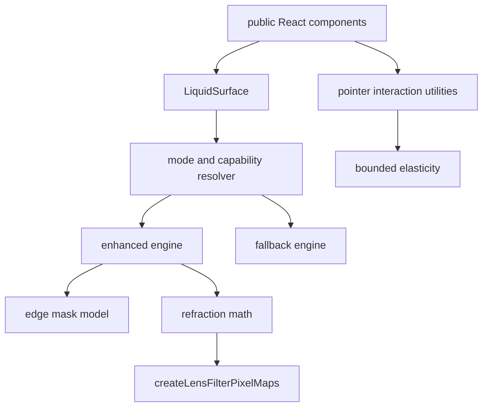

# rdev/liquid-glass-react Research Notes

`rdev/liquid-glass-react` was inspected at commit
`ac48eab18d1f7f444ae30002d240cae29c863a21`. The repository is MIT licensed.
This package uses it as a research reference only; no source files, baked
displacement maps, or image assets are copied into this repository.

## Useful Data Structures

The reference library collapses the entire effect into one component. The useful
parts are the data model underneath that component:

- `displacementScale`: scalar for edge displacement intensity.
- `blurAmount`: scalar for frosted material depth.
- `saturation`: backdrop color amplification.
- `aberrationIntensity`: RGB edge separation strength.
- `elasticity`: pointer-driven scale and translation strength.
- `cornerRadius`: rounded lens geometry.
- `mouseContainer`: larger pointer tracking region for demos.
- `globalMousePos` and `mouseOffset`: explicit pointer inputs for controlled
  demos.
- `mode`: precomputed displacement maps versus generated shader map.

Those are real concepts. The bad part is ownership: pointer tracking, SVG
filters, material styling, mode selection, and component semantics all live in
one component. This library keeps those concepts split into testable layers.

## What We Keep

### Edge-only refraction

The reference implementation uses filter composition to keep the center clean
while the edge bends the backdrop. That matches the physical target better than
uniformly warping the entire pill. Our equivalent pure model is
`sampleLiquidEdgeMask()`:

- edge opacity starts near `1`,
- refraction opacity falls toward `0` across the bevel,
- center opacity rises toward `1`,
- chromatic aberration is multiplied by edge opacity.

The invariant is not "draw a border". The invariant is "displace edge pixels and
restore the readable center".

### Bounded elasticity

The reference implementation activates pointer elasticity by distance from the
surface edge, then fades out across an activation zone. That is a good model for
Apple-like focus and pointer response because it avoids global mousemove effects
on every surface.

Our equivalent pure model is `resolveLiquidElasticResponse()`:

- pointer response is inactive outside the activation zone,
- scale follows the dominant pointer axis,
- translation and scale are capped,
- reduced motion returns the resting transform.

### Dynamic highlights

The reference implementation shifts border gradients using pointer offset. That
is worth keeping as a design direction, but it should remain a material layer,
not part of the filter map. A highlight can move; text should not distort.

## What We Reject

- Baked base64 displacement maps in source. They are large, opaque, hard to
  review, and hard to test.
- A single high-level component owning every concern.
- User-agent-only browser fallbacks.
- Applying filters to foreground text.
- Global pointer listeners for every surface.
- Unbounded chromatic aberration. RGB splitting is only credible at the bevel.

## Test Contract

The following gates make the research actionable:

- `tests/edge-mask.test.ts` proves the edge/center blend is monotonic,
  continuous, finite, and center-restoring.
- `tests/chromatic-aberration.test.ts` proves optional RGB splitting stays on
  the edge normal, fades to zero before the clean center, and shuts off for
  reduced-transparency paths.
- `tests/displacement-map.test.ts` proves generated maps keep the center neutral,
  bend each capsule edge in the expected normal direction, and isolate specular
  alpha to the bevel.
- `tests/elasticity.test.ts` proves pointer elasticity is bounded and respects
  reduced motion.
- `tests/refraction-physics.test.ts` proves foreground content stays outside the
  filter layer and that hard focus rings are regressions.
- `scripts/compare-kube-reference.mjs` captures Kube and Storybook with real
  browser pixels.
- `scripts/verify-liquid-behavior.mjs` performs real pointer and drag actions
  against built Storybook.

## Implemented Map Layer

`src/utils/displacement-map.ts` now connects capsule field sampling to generated
displacement maps. `createLensFilterPixelMaps()` returns displacement,
magnification, and specular pixel maps as pure data. The reference engine consumes
those maps; it does not own the optical sampling math. This keeps component code
reviewable and lets tests catch impossible map direction or center distortion
before screenshots are involved.

## Implemented Chromatic Layer

`src/utils/chromatic-aberration.ts` is the next research layer extracted from the
same review. The rdev filter splits red, green, and blue channel displacement at
the edge. This package keeps the principle, not the implementation:

- red and blue offsets are symmetric around the green channel,
- offsets follow the sampled surface normal instead of an arbitrary diagonal,
- tangent smear is forbidden,
- the amount is multiplied by the edge mask and becomes zero in the clean center,
- disabled and reduced-transparency paths return a resting sample.

The public pure function is `resolveLiquidChromaticAberration()`.

The model is intentionally not wired into `LiquidSurface` defaults. The
reference lens engine can opt into it for research captures, while the Kube
parity stories keep it disabled so the default two-pass SVG filter contract
does not drift.
