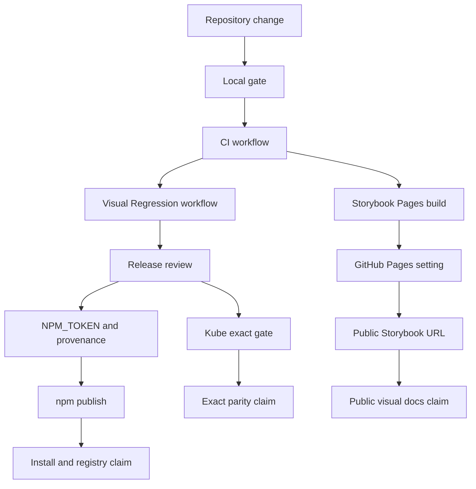

# Release Evidence Dashboard

This dashboard is the maintainer-facing proof map for public launch claims. It
keeps the same standard used by mature UI libraries: every public claim must
point to a file, a command, a workflow result, or a repository setting.

It is intentionally strict. Prepared is not published. A built Storybook is not
a public Pages site. A strict visual gate is not exact Kube parity.

## Evidence Flow

## Current Evidence Table

| Claim area           | Evidence source                                                                      | Current status                                      | Required before public claim                                    |
| -------------------- | ------------------------------------------------------------------------------------ | --------------------------------------------------- | --------------------------------------------------------------- |
| Repository identity  | GitHub API, `package.json`, README, topics, license.                                 | Proven for `clean99/liquid-glass`.                  | Keep description, topics, license, and package metadata synced. |
| Local governance     | `pnpm test:governance`, `pnpm test:docs`, `pnpm test:release-readiness`.             | Gate-backed locally.                                | Keep all three green after governance changes.                  |
| CI health            | `CI` workflow on `main`, Node 24, pnpm 11.5.2, workflow job timeout.                 | Latest main run must be checked before release.     | Required check passes on the release commit.                    |
| Visual regression    | `Visual Regression` workflow, `pnpm test:visual`, `pnpm test:kube-reference:strict`. | Strict visual gate is release-candidate evidence.   | Required check passes on the release commit.                    |
| Storybook Pages      | `Storybook Pages` workflow plus repository Pages API.                                | Build can pass; public URL waits for Pages setting. | Enable Pages with GitHub Actions and verify the public URL.     |
| npm package          | `release.yml`, Changesets, `NPM_TOKEN`, provenance, `pnpm pack --dry-run`.           | Prepared, not published to npm yet.                 | Successful release workflow publish with provenance.            |
| shadcn registry      | `registry.json`, `liquid-glass.json`, generated registry items.                      | Metadata is tested; consumer path waits for npm.    | npm package exists before documenting registry install as live. |
| Accessibility        | `docs/accessibility.md`, `pnpm test:a11y`, `pnpm test:e2e`, Storybook metadata.      | Gate-backed, not a WCAG certification claim.        | Keep a11y and e2e green on release commit.                      |
| Reference provenance | `ATTRIBUTIONS.md`, `docs/reference-provenance.json`, `pnpm test:research`.           | Gate-backed.                                        | Add every new external reference before using it.               |
| Kube exact parity    | `pnpm test:kube-reference:exact`.                                                    | Not complete.                                       | Exact gate passes with zero-diff thresholds.                    |

## Maintainer Scoreboard

| Score                               | Command or source                                               | Release meaning                                       |
| ----------------------------------- | --------------------------------------------------------------- | ----------------------------------------------------- |
| Local readiness                     | `pnpm audit:governance`                                         | Repository files satisfy the local governance model.  |
| Remote readiness                    | `CHECK_REMOTE_GOVERNANCE=1 pnpm audit:governance`               | GitHub Pages, homepage, wiki, and topics are checked. |
| Machine-readable automation payload | `CHECK_REMOTE_GOVERNANCE=1 pnpm --silent audit:governance:json` | Automation can report exact missing launch evidence.  |
| Public visual evidence              | `Storybook Pages` workflow plus Pages URL HTTP 200.             | Users can inspect the docs site.                      |
| Package evidence                    | Release workflow success plus npm package page.                 | Users can install the package.                        |

## Do Not Claim Until Proven

- Do not claim npm availability until the release workflow has published
  `@clean99/liquid-glass`.
- Do not claim public Storybook docs until GitHub Pages is enabled and the Pages
  URL resolves.
- Do not claim shadcn registry installation as a live consumer path until npm
  publication exists.
- Do not claim exact 1:1 Kube parity until `pnpm test:kube-reference:exact`
  passes.
- Do not replace source provenance with screenshots, blog summaries, or memory.
  New references must go through `ATTRIBUTIONS.md` or
  `docs/reference-provenance.json`.

## Reference Pattern

The dashboard follows the shared governance pattern visible in mainstream React
UI libraries:

- shadcn/ui separates registry mechanics from package and documentation work.
- Radix UI keeps accessibility and primitive boundaries central to the public
  value proposition.
- Chakra UI routes contribution, docs, and roadmap work through explicit
  contributor guidance.
- HeroUI exposes broad library operations through contribution, visual, docs,
  release, and maintainer paths.

This project uses that pattern without copying their source, prose, screenshots,
or repository structure.
