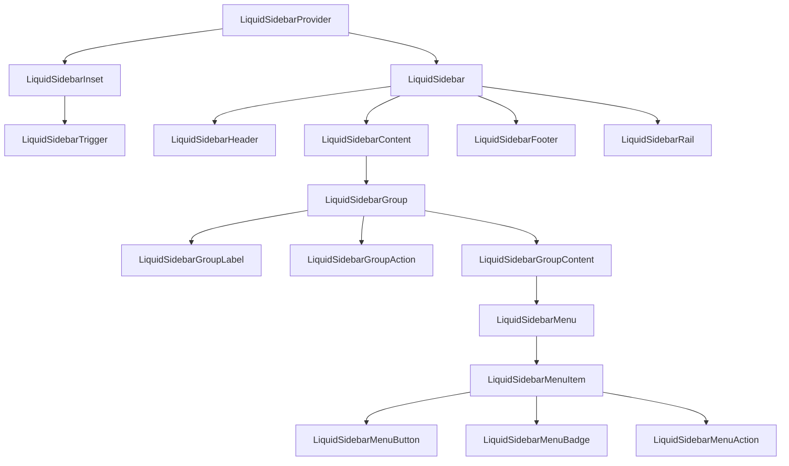

# LiquidSidebar Architecture

`LiquidSidebar` is the application-shell primitive for documentation, dashboards, and the blog
rewrite. It follows the shadcn/ui Sidebar composition model while keeping the Liquid Glass layer
pragmatic for dense navigation.

Reference: https://ui.shadcn.com/docs/components/sidebar

## Design Goals

- Provider-owned open state with controlled and uncontrolled modes.
- `side`, `variant`, and `collapsible` props matching the shadcn/ui mental model.
- Native list, button, link, and landmark semantics.
- Clear text in menu items; no per-row enhanced refraction.
- CSS variable widths so product shells can tune desktop and icon-rail layouts.

## Composition

## State Model

`LiquidSidebarProvider` owns one boolean: `open`.

- `defaultOpen` initializes uncontrolled state.
- `open` and `onOpenChange` support controlled state.
- `storageKey` can persist the state in `localStorage`.
- `LiquidSidebarTrigger` and `LiquidSidebarRail` call the same `toggleOpen` action.

Utility functions in `src/utils/sidebar.ts` keep the state and width mapping testable:

- `resolveSidebarState`
- `resolveSidebarWidth`
- `toggleSidebarOpen`
- `formatSidebarSize`

## Liquid Glass Policy

The sidebar panel uses fallback material tokens by default. It is a dense navigation region, so
enhanced refraction is intentionally not created for every menu item. Small controls such as
`LiquidSidebarTrigger` may use `LiquidButton` in fallback mode.

## Accessibility

- `LiquidSidebar` defaults to `role="complementary"`.
- Callers should pass an `aria-label` for the landmark.
- Active link buttons expose `aria-current="page"`.
- Active button controls expose `aria-pressed`.
- Trigger exposes `aria-expanded` and optional `aria-controls`.
- Menu structure uses native `ul` / `li`.

## Known Limits

This first release does not include a command-key shortcut or mobile-specific `openMobile` state.
Those will be added only when the blog/docs shell needs them, so the public API does not gain
unused state branches prematurely.
