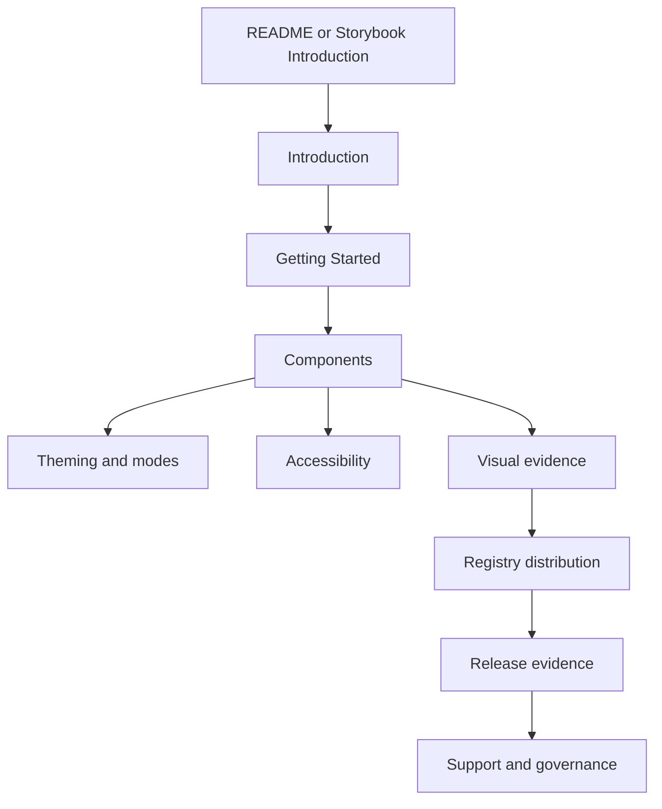

# Documentation Site Navigation

This file is the source-readable navigation model for the future public
Storybook Pages site. It keeps the docs shaped like a mainstream UI library
without claiming that the public site is already live.

The benchmark is structural only: shadcn/ui, Radix UI, Chakra UI, and HeroUI all
make the first docs screen route users into install, components, theming,
accessibility, registry or package distribution, contribution, changelog, and
release evidence. This project follows that information architecture without
copying third-party prose, source, screenshots, or page assets.

## Sidebar Model

| Sidebar group      | Primary pages                                                                                           | Release status rule                                              |
| ------------------ | ------------------------------------------------------------------------------------------------------- | ---------------------------------------------------------------- |
| Introduction       | `docs/index.md`, `docs/adoption-guide.md`, `docs/browser-support.md`                                    | Must keep npm, Pages, registry, and Kube exact status honest.    |
| Getting Started    | `docs/installation.md`, `docs/api-overview.md`, `docs/design-principles.md`                             | Install commands stay post-publish until npm exists.             |
| Components         | `docs/components/index.md`, `docs/components/map.md`, `docs/component-documentation.md`                 | Component claims must point to inventory, Storybook, and tests.  |
| Forms and Controls | `docs/components/field.md`, `docs/components/select.md`, `docs/components/date-picker.md`               | Focus, keyboard, and material state claims need e2e evidence.    |
| Visual Evidence    | `docs/visual-documentation.md`, `docs/visual-state-coverage.json`, `docs/kube-parity-gate.md`           | Strict Kube gate is not exact 1:1 parity.                        |
| Registry           | `docs/shadcn-registry.md`, `registry.json`, `liquid-glass.json`, `registry/components/*.json`           | Registry install is a live consumer path only after npm publish. |
| Accessibility      | `docs/accessibility.md`, `docs/testing.md`                                                              | Accessibility docs are a contract, not a WCAG certification.     |
| Governance         | `docs/open-source-governance.md`, `docs/governance-scorecard.md`, `docs/progress-checkpoints.md`        | Governance score is local unless remote settings are checked.    |
| Release            | `docs/release-evidence.md`, `docs/open-source-release.md`, `docs/maintainer-runbook.md`, `CHANGELOG.md` | Release claims need workflow, Pages, npm, or exact gate proof.   |
| Support            | `CONTRIBUTING.md`, `SUPPORT.md`, `SECURITY.md`, `CODE_OF_CONDUCT.md`, `MAINTAINERS.md`                  | Security and support routing must stay visible from the repo.    |

## User Journey

## Storybook Landing Blocks

The Storybook Introduction page should present these blocks in this order:

| Block                | Purpose                                                                 | Source of truth                         |
| -------------------- | ----------------------------------------------------------------------- | --------------------------------------- |
| Product promise      | One short description of Liquid Glass components and fallback behavior. | `README.md`, `docs/index.md`.           |
| Status honesty       | npm, Pages, registry, Kube strict, and Kube exact state.                | `docs/release-evidence.md`.             |
| Start here           | Install, API, design principles, components, accessibility, registry.   | `docs/site-navigation.md`.              |
| Component groups     | Foundations, forms, navigation, overlays, data, feedback, reference.    | `docs/component-inventory.json`.        |
| Visual documentation | State profiles, Storybook, a11y, visual regression, Kube gates.         | `docs/visual-documentation.md`.         |
| Release and support  | Release checklist, roadmap, contribution, security, support.            | `docs/open-source-release.md`, support. |

## Maintenance Rules

- Add new top-level docs pages here before linking them from Storybook.
- Do not duplicate component implementation status by hand; use
  `docs/component-inventory.json` and `docs/components/map.md`.
- Do not claim Storybook Pages as public until the Pages URL returns HTTP 200.
- Do not claim registry install as live until npm publication exists.
- Do not claim exact Kube parity as complete until `pnpm test:kube-reference:exact`
  passes.
