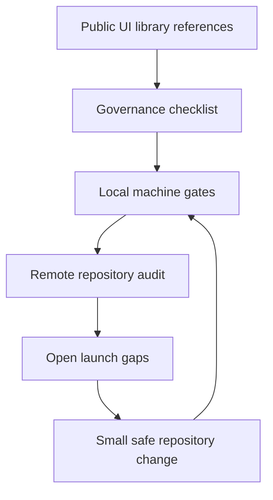

# UI Library Benchmark

This benchmark tracks the repository governance surface against public React UI
library repositories without copying third-party source code, assets, or prose.

Observed public references as of June 13, 2026:

- `shadcn-ui/ui`
- `radix-ui/primitives`
- `chakra-ui/chakra-ui`
- `heroui-inc/heroui`

These projects are not identical. The useful standard is the shared public
surface: a clear first screen, issue routing, contribution guidance, release
gates, security policy, package metadata, docs site, accessibility posture, and
discoverability.

## Measurement Loop

## Public Benchmark Surface

| Surface                    | Benchmark pattern                                                                     | Local evidence                                                                                                                                | Status                                | Gate or check                                          |
| -------------------------- | ------------------------------------------------------------------------------------- | --------------------------------------------------------------------------------------------------------------------------------------------- | ------------------------------------- | ------------------------------------------------------ |
| First screen               | README routes users to docs, adoption, install, contributing, security, and releases. | `README.md`, `docs/adoption-guide.md`, `docs/installation.md`, `docs/open-source-release.md`, `SECURITY.md`.                                  | Gate-backed                           | `pnpm test:docs`, `pnpm test:governance`               |
| Reference provenance       | Public references are named and attribution is explicit.                              | `ATTRIBUTIONS.md`, `docs/reference-provenance.json`, `docs/reference-research.md`.                                                            | Gate-backed                           | `pnpm test:research`                                   |
| Contribution workflow      | Issue templates and PR checks tell contributors what proof is required.               | `.github/ISSUE_TEMPLATE/*`, `.github/PULL_REQUEST_TEMPLATE.md`, `CONTRIBUTING.md`, `.github/CODEOWNERS`.                                      | Gate-backed                           | `pnpm test:docs`, `pnpm test:release-readiness`        |
| Maintainer operations      | Triage, release, rollback, security, Pages, and CI failures have a reviewable path.   | `MAINTAINERS.md`, `docs/maintainer-runbook.md`, `docs/github-repository-settings.md`, `docs/open-source-release.md`.                          | Gate-backed                           | `pnpm test:docs`, `pnpm test:governance`               |
| Support routing            | Usage, bug, registry, security, and release questions go to the right place.          | `SUPPORT.md`, `.github/ISSUE_TEMPLATE/config.yml`, issue forms, and `SECURITY.md`.                                                            | Gate-backed                           | `pnpm test:docs`, `pnpm test:governance`               |
| Release engineering        | CI and release workflows run the same gates maintainers run locally.                  | `.github/workflows/ci.yml`, `.github/workflows/release.yml`, Changesets, package dry run.                                                     | Gate-backed                           | `pnpm verify`, `pnpm test:release-readiness`           |
| Release evidence           | Public claims are separated from local preparedness with a visual proof map.          | `docs/release-evidence.md`, remote-aware governance audit, workflow results, npm and Pages status.                                            | Gate-backed; remote claims blocked    | `pnpm test:docs`, remote-aware `pnpm audit:governance` |
| Accessibility              | Accessibility is treated as a release property, not just documentation.               | Storybook a11y addon, `scripts/verify-storybook-a11y.mjs`, `pnpm test:a11y`.                                                                  | Gate-backed                           | `pnpm test:a11y`                                       |
| Visual documentation       | Component states are visible through examples, snapshots, and docs site.              | `docs/visual-documentation.md`, `docs/visual-state-coverage.json`, Storybook stories, Playwright snapshots.                                   | Local gate-backed; public URL blocked | `pnpm test:visual-docs`, Pages workflow                |
| Component page standard    | Component docs repeat install, usage, anatomy, API, states, accessibility, and gates. | `docs/component-documentation.md`, `docs/components/index.md`, `docs/components/map.md`, component inventory, visual-state coverage, stories. | Gate-backed                           | `pnpm test:docs`, `pnpm test:governance`               |
| Visual regression signal   | Pull requests and default branch pushes expose visual and Kube strict gates.          | `.github/workflows/visual.yml`, Playwright visual snapshots, strict Kube reference comparison.                                                | Main push gate-backed                 | Visual Regression workflow                             |
| Story-level state metadata | Public component stories expose machine-readable state profile metadata.              | `parameters.visualState` on every implemented component story plus `docs/visual-state-coverage.json#storyEvidence`.                           | Component stories gate-backed         | `pnpm test:visual-docs`                                |
| Registry distribution      | Registry metadata is source-readable and tested before users install it.              | `registry.json`, `liquid-glass.json`, `registry/liquid-glass.json`, `docs/shadcn-registry.md`.                                                | Prepared; npm publish blocked         | `pnpm test:registry`, `pnpm test:shadcn-parity`        |
| Component inventory        | Public component surface is documented and checked.                                   | `docs/component-inventory.json`, `docs/component-inventory.md`, generated registry items.                                                     | Gate-backed                           | `pnpm test:inventory`, `pnpm test:component-coverage`  |
| Dependency governance      | Dependency updates are grouped so maintenance noise stays readable.                   | `.github/dependabot.yml`.                                                                                                                     | Gate-backed                           | `pnpm test:docs`, `pnpm test:governance`               |
| Repository discoverability | Description, topics, homepage, Pages, and wiki settings do not contradict docs.       | Package keywords, GitHub About metadata, `docs/github-repository-settings.md`.                                                                | Partly blocked by repo settings       | remote-aware `pnpm audit:governance`                   |
| Publish readiness          | Package metadata, provenance, files, and release workflow are ready to ship.          | `package.json`, `.changeset/config.json`, release workflow, release checklist.                                                                | Prepared; not published               | `pnpm test:release-readiness`, `pnpm test:package`     |

## Quantified Status

| Score                 | Value | Meaning                                                                 |
| --------------------- | ----- | ----------------------------------------------------------------------- |
| Local governance gate | 10/10 | Repository files and scripts satisfy the local governance scorecard.    |
| Public launch score   | 18/22 | Four points remain blocked by remote settings or first npm publication. |

Open public launch points:

- GitHub Pages must be enabled with GitHub Actions as the source.
- GitHub About homepage should point to the first successful Storybook Pages URL.
- Wiki should be disabled while repository docs are canonical.
- `@clean99/liquid-glass` must be published before install and registry claims can become live.

## Visual Documentation Gaps

The visual side is close but not finished. Do not claim public visual docs until
Storybook Pages succeeds.

| Gap                   | Why it matters                                                          | Required proof                                      |
| --------------------- | ----------------------------------------------------------------------- | --------------------------------------------------- |
| Public Storybook URL  | Users cannot inspect visual states from GitHub yet.                     | Successful Pages deploy and README/homepage update. |
| Exact Kube parity     | Strict reference gate passes, but exact 1:1 pixel parity is still open. | `pnpm test:kube-reference:exact` passes.            |
| Registry install path | Registry files exist, but package-backed imports need npm availability. | First successful npm publish with provenance.       |

## What Not To Copy

The benchmark is intentionally structural. It does not copy code, screenshots,
README artwork, docs prose, issue wording, or component implementations from
shadcn/ui, Radix UI, Chakra UI, HeroUI, Kube, rdev, or shuding.
