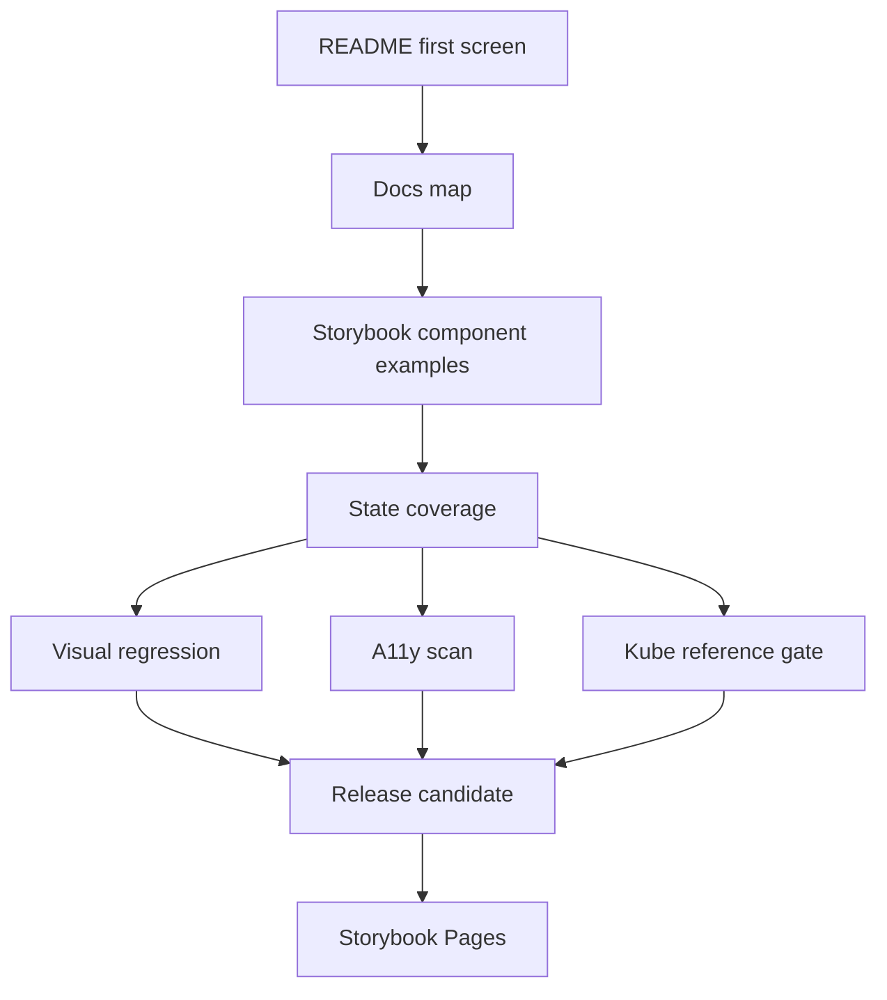
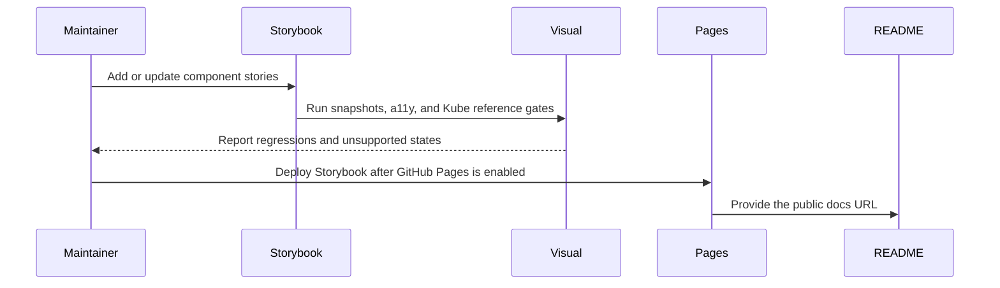

# Visual Documentation

Mainstream UI libraries make the visual contract obvious before users read the
API. `@clean99/liquid-glass` needs the same discipline, but without pretending
that a local Storybook is already a public docs site.

## Reference Patterns

| Project                           | Public pattern to match                                                                  | Local decision                                                                  |
| --------------------------------- | ---------------------------------------------------------------------------------------- | ------------------------------------------------------------------------------- |
| shadcn/ui                         | README has a hero image, direct docs link, contribution link, security policy, and tags. | Keep the README honest and route users to Storybook Pages after it is enabled.  |
| Radix UI (`radix-ui/primitives`)  | README points to docs, releases, contributing, community, and visual regression support. | Treat visual regression as release evidence, not decorative screenshots.        |
| Chakra UI (`chakra-ui/chakra-ui`) | README shows visual branding, docs versions, install commands, usage, and contributing.  | Keep install commands gated until npm is actually published.                    |
| heroui-inc/heroui                 | README explains packages, quick start, target users, accessibility, and modern tooling.  | Keep the first screen focused on components, accessibility, fallback, and docs. |

No source code or visual assets are copied from these projects. They are used
only as governance and documentation references.

## Visual Documentation Contract



The visual docs are acceptable when a maintainer can answer four questions from
the repository without running a private demo:

| Question                          | Required evidence                                                                  |
| --------------------------------- | ---------------------------------------------------------------------------------- |
| What does the material look like? | Storybook examples for enhanced, fallback, solid, and off modes.                   |
| Does it survive real states?      | Light and dark, focus, hover, pressed, disabled, loading, selected, and invalid.   |
| Does it degrade correctly?        | Reduced motion, reduced transparency, High contrast, mobile, Safari-like fallback. |
| Is the reference claim honest?    | Kube reference gate is documented separately from exact pixel parity.              |

## Current Evidence

| Surface                 | Evidence                                                                                                                                                                                           | Status                          |
| ----------------------- | -------------------------------------------------------------------------------------------------------------------------------------------------------------------------------------------------- | ------------------------------- |
| README first screen     | Short product positioning, direct docs link, status honesty, install honesty, registry honesty, Kube parity honesty.                                                                               | Present                         |
| Storybook examples      | `stories/*.stories.tsx` plus `.storybook` docs and a11y addon configuration.                                                                                                                       | Present locally                 |
| Docs navigation model   | `docs/site-navigation.md` defines the future Storybook Pages sidebar and landing blocks.                                                                                                           | Present                         |
| Component page shape    | `docs/component-documentation.md` defines required status, anatomy, API, states, and gates.                                                                                                        | Present                         |
| Written component pages | `docs/components/index.md` links 33 full pages, including the new ButtonGroup, Input, InputGroup, InputOtp, Label, NativeSelect, RadioGroup, Textarea, Toggle, and ToggleGroup form/control pages. | Expanded                        |
| Storybook Pages         | `.github/workflows/pages.yml` builds Storybook and runs a11y before deploy.                                                                                                                        | Blocked until Pages is enabled  |
| Visual regression       | `tests/visual/liquid-components-visual.spec.ts` and checked-in Playwright snapshots.                                                                                                               | Present                         |
| Visual state audit      | `docs/visual-state-coverage.json` assigns every implemented component to a state profile.                                                                                                          | Present                         |
| Story state metadata    | Every implemented component story and Kube/reference story exposes `parameters.visualState`.                                                                                                       | Present and gate-backed         |
| A11y evidence           | `docs/accessibility.md` and `pnpm test:a11y` define and test the accessibility contract.                                                                                                           | Present                         |
| Kube reference          | `pnpm test:kube-reference` and `docs/kube-parity-gate.md` separate strict and exact parity.                                                                                                        | Strict gate present; exact open |
| Release visibility      | `docs/open-source-release.md` requires local gates before release or publish.                                                                                                                      | Present                         |

## Quantitative Dashboard

The visual documentation audit turns the state coverage map into a small
maintainer dashboard:

```sh
pnpm audit:visual-docs
pnpm --silent audit:visual-docs:json
```

`pnpm test:visual-docs` runs both the structural validator and this dashboard
with the current minimum score. The human output includes:

| Metric                           | Meaning                                                                    |
| -------------------------------- | -------------------------------------------------------------------------- |
| `visual-docs-component-coverage` | Implemented components assigned to exactly one visual state profile.       |
| `visual-docs-profile-contract`   | Profiles carrying required material-mode and environment review coverage.  |
| `visual-docs-story-evidence`     | Story evidence rows whose Storybook file, component, and tags are present. |
| `visual-docs-reference-evidence` | Kube/reference rows that keep strict and exact parity claims separate.     |
| `visual-docs-score`              | Aggregate score for automation and maintainer checkpoint reports.          |

The dashboard is local evidence. It does not prove that users can browse public
visual docs; that claim still requires GitHub Pages to be enabled and the Pages
URL to return HTTP 200.

## Required State Matrix

Every public component page or Storybook story should cover the states that make
sense for that component. Static display components can mark inapplicable states
as not applicable, but interactive components should not silently skip them.
`docs/component-documentation.md` defines the required per-component page
sections, and `docs/components/index.md` starts applying that structure to core
components so visual states, accessibility notes, registry entries, and
verification commands do not drift into separate claims.

| State group        | Examples                                                                | Gate or location                                  |
| ------------------ | ----------------------------------------------------------------------- | ------------------------------------------------- |
| Interaction        | Default, hover, focus-visible, pressed, disabled, loading, selected.    | Storybook examples and visual snapshots.          |
| Accessibility      | Keyboard path, label/description, error, screen-reader semantics.       | Unit tests, `pnpm test:a11y`, and docs notes.     |
| Material mode      | Enhanced, fallback, solid, off.                                         | Storybook examples and `docs/browser-support.md`. |
| Environment        | Light and dark, High contrast, reduced motion, reduced transparency.    | Visual snapshots and a11y Storybook scan.         |
| Layout             | Mobile, dense content, long labels, scroll/overflow, nested surfaces.   | Storybook examples and Playwright screenshots.    |
| Reference behavior | Kube reference, pressed lens, dragged lens, strict versus exact parity. | `docs/kube-parity-gate.md` and reference tests.   |

## Publication Flow



## Current Gaps

| Gap                       | Why it matters                                                        | Next action                                              |
| ------------------------- | --------------------------------------------------------------------- | -------------------------------------------------------- |
| Pages is not enabled      | Users cannot inspect the full visual documentation from the repo URL. | Enable GitHub Pages with GitHub Actions as the source.   |
| Homepage is not set       | GitHub About cannot route users to the public visual docs yet.        | Set homepage after the first Pages deploy succeeds.      |
| Exact Kube parity is open | The strict gate is useful, but it is not a 1:1 visual claim.          | Keep exact parity out of release claims until it passes. |
